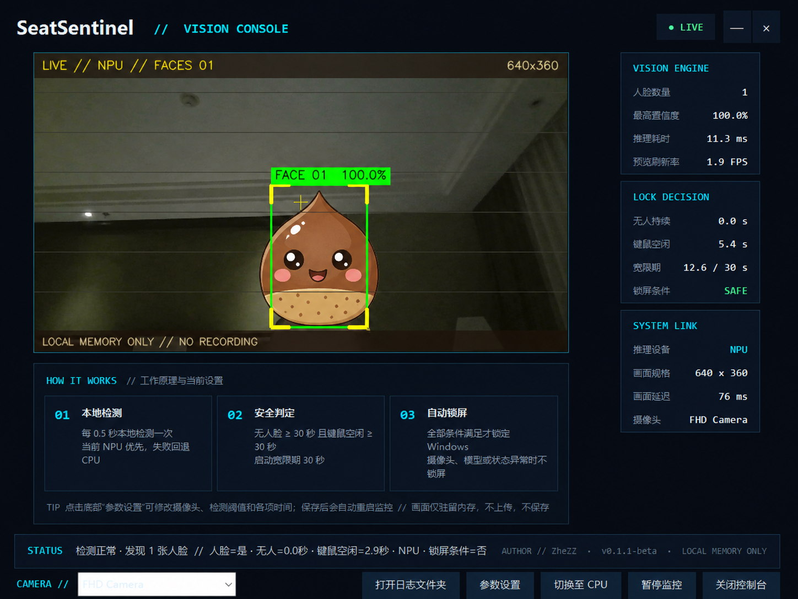

# SeatSentinel


SeatSentinel 是一款面向 Windows 11 的本地离席自动锁屏工具。它通过摄像头和
OpenVINO 调用 NPU 或 CPU 判断电脑前是否有人，再结合 Windows 最近键盘、鼠标活动
时间，在满足全部安全条件时调用系统锁屏。用户可以选择“任意人脸”或“仅本人”
两种在场判断方式。

摄像头画面和模型推理全部在本机完成。SeatSentinel 不上传、不拍照、不录像，
画面仅短暂保存在内存中。完整说明见 [PRIVACY.md](PRIVACY.md)。


## 界面预览



> 为保护隐私，截图已遮挡真人面部。图中 30 秒为用户自定义参数，项目默认的
> 无人脸及键鼠空闲锁屏时间均为 60 秒。

## 功能亮点

- 支持“任意人脸”和“仅本人（需注册）”两种在场判断模式；
- 仅本人模式在本地完成关键点对齐和人脸特征比对，陌生人不会重置离席计时；
- 注册时只保存 Windows 用户级加密的 256 维特征模板，不保存注册照片；
- 优先使用 OpenVINO NPU，失败时自动回退 CPU；
- 可在调试控制台或设置中随时切换 NPU / CPU；
- 同时检查“未确认在场时间”和“键鼠空闲时间”，降低误锁概率；
- 锁屏、暂停或摄像头异常时立即释放摄像头并清空调试画面；
- Windows 解锁后自动恢复监控；
- 支持指定摄像头名称，避免误用手机联动或虚拟摄像头；
- 视觉控制台可直接下拉切换摄像头并安全重启监控；
- 科技风实时控制台，显示人脸框、置信度、推理耗时和锁屏判定；
- 调试控制台打开时显示独立的 Windows 任务栏图标，便于确认和快速切回窗口；
- 达到锁屏条件后先显示 5 秒柔和提示，检测到在场或键鼠操作会立即取消；
- EXE、调试窗口和托盘统一使用专属图标；监控运行显示彩色图标，暂停时显示灰色图标和琥珀色状态点；
- 托盘驻留、单实例运行，重复启动时唤出已有调试窗口；
- 参数保存在本地，不设置开机自动启动。

## 锁屏逻辑

SeatSentinel 只有在以下条件全部成立时才会锁屏：

```text
摄像头正常
AND 模型推理正常
AND 连续 60 秒未确认有人在场
AND 最近 60 秒无键盘或鼠标输入
AND 本轮监控启动已超过 30 秒
AND 上述锁屏条件连续保持满 5 秒提示倒计时
AND 当前尚未执行锁屏
```

“任意人脸”模式下，任意人脸都表示有人在场；“仅本人”模式下，只有连续两帧
识别为已注册本人才能重置离席计时，陌生人和无人脸均表示本人不在。
达到条件后，屏幕顶部会显示不抢焦点的 5 秒半透明提示；倒计时期间继续检测，
只要本人/人脸重新出现或发生键鼠操作，提示即消失并取消本次锁屏。调用
`LockWorkStation` 前还会再次检查键鼠活动。摄像头读取失败、模型异常或 Windows
状态不明确时均不会锁屏。

## 注册本人和切换模式

1. 从托盘菜单选择“注册 / 更新本人”，或在“设置”中点击“注册本人”；
2. 保证画面中只有本人一人，正对摄像头并缓慢左右转头；
3. 完成 12 个本地特征样本采集后，在“设置 → 在场判断”中选择
   “仅本人（需注册）”；
4. 如需恢复原有行为，随时切回“任意人脸”。

更新注册会替换旧模板；“删除本人数据”会删除模板并自动切回任意人脸模式。
本功能不是活体检测或身份认证，照片、屏幕视频等可能造成误识别，因此不能用于
Windows 解锁或替代 Windows Hello。

## 从源码运行

环境要求：

- Windows 11 64 位；
- Python 3.13 64 位（已在 Python 3.13.12 上验证）；
- 可用摄像头；
- NPU 可选，没有 NPU 时自动使用 CPU。

最简单的方式是右键 `一键启动.ps1`，选择“使用 PowerShell 运行”。脚本会：

1. 检查 Python 3.13；
2. 创建 `.venv`；
3. 安装依赖；
4. 从 Intel Open Model Zoo 下载缺少的人脸检测、关键点和特征模型；
5. 校验全部六个模型文件的 SHA-256；
6. 启动 SeatSentinel。

也可以手动安装：

```powershell
py -3.13 -m venv .venv
.\.venv\Scripts\Activate.ps1
python -m pip install -r requirements.txt
python app.py
```

仅运行控制台监控：

```powershell
python main.py
```

首次启动若默认摄像头不可用，SeatSentinel 会保持安全状态并禁止锁屏。请打开
调试控制台，在底部 `CAMERA //` 下拉框中选择本机摄像头；无需修改源码。
更完整的首次启动摄像头选择向导已列入 [ROADMAP.md](ROADMAP.md)。

## 模型

模型文件不包含在 Git 仓库中。`一键启动.ps1` 会从 Intel 官方存储地址下载
Open Model Zoo 2022.1 FP32 版本：

```text
models/
├─ face-detection-retail-0004.xml
├─ face-detection-retail-0004.bin
├─ landmarks-regression-retail-0009.xml
├─ landmarks-regression-retail-0009.bin
├─ face-reidentification-retail-0095.xml
└─ face-reidentification-retail-0095.bin
```

固定 SHA-256：

| 文件 | SHA-256 |
| --- | --- |
| `face-detection-retail-0004.xml` | `E1103759CF32B74AE3C2E84E9653DB5FA0D69AC246DC1E17AC3B116EFF319459` |
| `face-detection-retail-0004.bin` | `89349CE12DD21C5263FB302CD3FFD4B73C35EA12ED98AFF863D03A2CF3A32464` |
| `landmarks-regression-retail-0009.xml` | `8EDE1C8A94BFF1C0DDDA96F938CB872249BD0E1E33E77315498C8A8F17470AC1` |
| `landmarks-regression-retail-0009.bin` | `71199E8D6DF4583C3BA4AD8EAB013F36995B9FEF2DD6D85D86C2CC2322803955` |
| `face-reidentification-retail-0095.xml` | `9148EB0E6578807B073F2A90649C701566A277DF1A2086E769C2CB263CC66B86` |
| `face-reidentification-retail-0095.bin` | `C0A0ACB57503ACB0B04A9AA3B1A6DA7165C799D0DC2A462AD6B081A5CD1BC908` |

下载文件如果大小异常或哈希不一致会被拒绝，不会交给 OpenVINO 加载。XML 和
BIN 必须来自同一模型版本及同一精度目录。

只校验本地模型而不启动程序：

```powershell
.\一键启动.ps1 -VerifyModelsOnly
```

模型输出按以下格式解析：

```text
[image_id, label, confidence, xmin, ymin, xmax, ymax]
```

坐标从归一化值换算到原始摄像头画面，并限制在图像范围内。仅本人模式随后使用
五个人脸关键点进行仿射对齐，通过 `face-reidentification-retail-0095` 生成归一化
256 维特征，并按余弦相似度判断是否为本人。

## NPU / CPU 切换

默认选择 NPU：

- NPU 可用且模型编译成功：使用 NPU；
- NPU 不存在或编译失败：自动回退 CPU；
- 手动选择 CPU：直接使用 CPU，不再尝试 NPU。

调试控制台底部提供“切换至 CPU / 尝试切换至 NPU”按钮，也可以在“参数设置”
中选择推理设备。切换时 SeatSentinel 会安全释放摄像头和模型，然后自动恢复监控。

## 调试控制台

调试窗口复用监控线程读取的最新画面，不会重复打开摄像头。界面显示：

- 摄像头实时画面；
- 人脸检测框、检测置信度和本人相似度；
- 本人显示绿色 `SELF`，陌生人显示红色 `OTHER`；
- NPU / CPU 推理设备；
- 单次推理耗时和预览刷新率；
- 无人持续时间、键鼠空闲时间和宽限期；
- 当前锁屏条件与摄像头状态。

底部 `CAMERA //` 下拉框会枚举当前可用摄像头。选择新设备后，SeatSentinel 会
保存设置、清空调试帧、安全释放原摄像头并自动恢复监控。

OpenCV 的 BGR 画面在显示前转换为 RGB，并按原始比例缩放。Tkinter 主线程
只读取线程安全的最新帧缓冲区，监控线程不会直接操作界面控件。

## 默认配置

主要默认值位于 `config.py`：

| 参数 | 默认值 | 含义 |
| --- | ---: | --- |
| `PREFERRED_CAMERA_NAME` | `FHD Camera` | 优先摄像头名称 |
| `DETECTION_INTERVAL_SECONDS` | `0.5` | 检测间隔 |
| `FACE_CONFIDENCE_THRESHOLD` | `0.6` | 人脸置信度阈值 |
| `PREFERRED_INFERENCE_DEVICE` | `NPU` | 首选推理设备 |
| `PRESENCE_MODE` | `ANY_FACE` | 任意人脸或仅本人模式 |
| `FACE_MATCH_SIMILARITY_THRESHOLD` | `0.70` | 本人余弦相似度阈值 |
| `IDENTITY_MATCH_CONFIRMATION_FRAMES` | `2` | 本人连续确认帧数 |
| `FACE_ABSENCE_TIMEOUT_SECONDS` | `60` | 未确认在场的锁屏计时 |
| `INPUT_IDLE_TIMEOUT_SECONDS` | `60` | 键鼠空闲锁屏计时 |
| `STARTUP_GRACE_PERIOD_SECONDS` | `30` | 启动/恢复宽限期 |
| `LOCK_WARNING_SECONDS` | `5` | 锁屏前可取消提示时长 |
| `FRAME_WIDTH` | `640` | 摄像头画面宽度 |
| `FRAME_HEIGHT` | `360` | 摄像头画面高度 |

源码运行时会在项目目录生成已被 Git 忽略的 `settings.json`。字段示例见
`settings.example.json`。打包版数据保存在：

```text
%LOCALAPPDATA%\SeatSentinel\settings.json
%LOCALAPPDATA%\SeatSentinel\logs\seat-sentinel.log
%LOCALAPPDATA%\SeatSentinel\registered-face.dat
```

## 隐私边界

- 摄像头帧只保存在内存中；
- 不上传画面、检测框或推理结果；
- 不写入照片或视频文件；
- 仅本人模式会保存一个由当前 Windows 用户级 DPAPI 加密的特征模板；
- 不在日志中记录摄像头画面；
- 锁屏、暂停、摄像头释放和程序退出时立即清空最新帧；
- 摄像头或推理状态不可靠时采用“禁止锁屏”的安全策略；
- SeatSentinel 不初始化 OpenVINO 转换工具的可选遥测，并在导入 OpenVINO 前
  设置进程级 `DO_NOT_TRACK=1` 与 `SCARF_NO_ANALYTICS=1`。

正常监控代码没有联网功能。只有 `一键启动.ps1` 在安装依赖和下载模型时访问
网络。数据保存范围、日志内容和第三方组件边界见 [PRIVACY.md](PRIVACY.md)。

## 本地测试

```powershell
python -m compileall .
python -m unittest discover -s tests -v
python app.py --self-test
```

`--self-test` 不会打开摄像头。它会验证三组模型及 256 维特征链路，并枚举摄像头
用于诊断；已保存的设备名称在另一台电脑上不存在时只记录警告，不会把跨设备
差异误判为程序故障。

## 本地构建 EXE

仓库只发布源码，不提交 `dist` 或 EXE。需要时可在本机运行：

```powershell
.\构建EXE.ps1
```

构建脚本会执行依赖检查、PyInstaller 打包、打包版 `--self-test` 和 ZIP 压缩，
并清理 `build` 中间目录。生成内容已由 `.gitignore` 排除。

## 项目结构

```text
.
├─ app.py
├─ main.py
├─ detector.py
├─ face_identity.py
├─ face_registration.py
├─ camera.py
├─ debug_frame.py
├─ activity_monitor.py
├─ session_monitor.py
├─ windows_lock.py
├─ single_instance.py
├─ user_settings.py
├─ config.py
├─ settings.example.json
├─ assets/
│  ├─ seatsentinel-icon.png
│  └─ seatsentinel-icon.ico
├─ tests/
├─ docs/
│  └─ seatsentinel-vision-console.png
├─ models/
│  └─ .gitkeep
├─ PRIVACY.md
├─ SECURITY.md
├─ THIRD_PARTY_NOTICES.md
├─ ROADMAP.md
├─ 一键启动.ps1
├─ 打开调试界面.cmd
└─ 构建EXE.ps1
```

## 安全与第三方组件

- 安全问题报告方式见 [SECURITY.md](SECURITY.md)；
- 第三方软件及模型许可见
  [THIRD_PARTY_NOTICES.md](THIRD_PARTY_NOTICES.md)；
- 后续计划见 [ROADMAP.md](ROADMAP.md)。

## 许可证

SeatSentinel 采用 [MIT License](LICENSE) 开源。第三方软件和模型继续适用其各自
许可证，详见 [THIRD_PARTY_NOTICES.md](THIRD_PARTY_NOTICES.md)。

## 作者

ZheZZ
